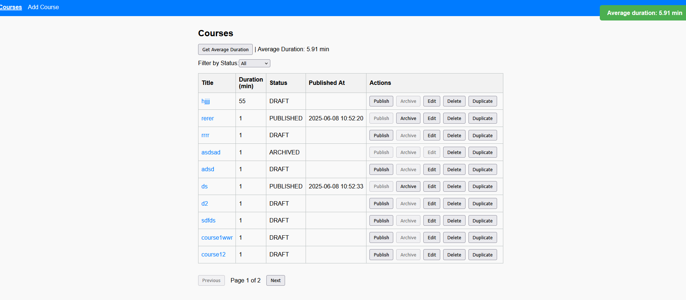

# 🎓 Course Management Application

A full-stack web application for managing online courses. Built with **Angular** (frontend) and **Spring Boot** (backend).

## 📁 Project Structure

```
coursemanagement/
├── course-management-frontend/   # Angular 17 frontend
└── src/                          # Spring Boot backend
```

## 🚀 Technologies

- **Frontend:** Angular 17, TypeScript, RxJS, SCSS
- **Backend:** Spring Boot 3, Java 21, REST API, PostgreSQL, H2(for tests)
- **Tooling:** ESLint, Prettier, Swagger/OpenAPI, Toast Notifications

## 🔧 Setup Instructions

### 📦 Backend

#### ✅ Requirements
- Java 21
- Maven 3.8+
- PostgreSQL (optional – H2 in-memory for tests)

#### ▶️ Run the backend - locally

```bash (powershell)
cd coursemanagement
./mvnw clean install
./mvnw spring-boot:run --% -Dspring-boot.run.profiles=dev

```

#### ▶️ Run the backend - Dockerized

```bash (powershell)
cd coursemanagement
./mvnw clean install
cd .\docker\
docker-compose up --build

```

#### 🔍 API Docs

Swagger UI available at:

```
http://localhost:8080/swagger-ui/index.html
```

### 💻 Frontend

#### ✅ Requirements
- Node.js (v20+ recommended)
- Angular CLI

#### ▶️ Run the frontend

```bash
cd coursemanagement
cd course-management-frontend
npm install
ng serve
```

Visit the app at:

```
http://localhost:4200
```

#### Sreenshot



#### 🌐 API URL Configuration

Environment config in `src/environments/environment.ts`:

```ts
export const environment = {
  production: false,
  apiUrl: 'http://localhost:8080/api'
};
```

In services, use:

```ts
private apiUrl = `${environment.apiUrl}/courses`;
```

## ✅ Features

### 🔹 Backend – Java Spring Boot / Hibernate / RESTful API

- Course entity with fields:
- RESTful API with JSON responses
- Hibernate ORM with PostgreSQL
- Dockerized backend service
- CRUD operations for courses
- DTOs for separating internal/external data structures
- Data validation rules:
- Custom state logic:
    - Course can be published only if `title` and `duration` are set
    - `publishedAt` is set automatically on publish
    - Archived courses are read-only
- Custom controller for state transitions
- Bonus Features:
    - Service for calculating average course duration
    - Endpoint for retrieving published courses within a date range
    - Swagger/OpenAPI documentation

### 🔹 Frontend – Angular

- Course List page with status filter
- Create/Edit Course page
- Publish/Archive Course actions with state-aware buttons
- Display `publishedAt` only when course is published
- Basic form validation (required fields, positive duration)
- Backend interaction using `fetch`
- Bonus Features:
    - UI feedback via toast/inline error messages
    - Pagination for course list

### 🔹 Business Logic

- Clean separation of concerns:
    - Controller handles API routes
    - Service layer processes business logic
    - Entity layer for persistence
- Logic such as course publishing/archiving handled outside API/database layer
- Extensible and testable service structure

---

### 🔹 Code Quality & Project Setup

- Clean project structure:
    - `src/domain`, `src/service`, `src/controller`
- Follows PSR-12, ESLint, Prettier guidelines
- Uses `.env` for environment-specific configuration
- Setup instructions documented for both backend and frontend

## 📦 API Endpoints (Examples)

| Method | Endpoint                               | Description                                       |
| ------ | -------------------------------------- | ------------------------------------------------- |
| GET    | `/api/courses`                         | Get paginated courses (optional filter by status) |
| GET    | `/api/courses/{id}`                    | Get course by ID                                  |
| POST   | `/api/courses`                         | Create new course                                 |
| PUT    | `/api/courses/{id}`                    | Update course by ID                               |
| DELETE | `/api/courses/{id}`                    | Delete course by ID                               |
| POST   | `/api/courses/{id}/publish`            | Publish a course                                  |
| POST   | `/api/courses/{id}/archive`            | Archive a course                                  |
| POST   | `/api/courses/{id}/duplicate`          | Duplicate a course (as DRAFT)                     |
| GET    | `/api/courses/average-duration`        | Get average duration of all courses               |
| GET    | `/api/courses/published?start=X&end=Y` | Get published courses in date range               |


## 📄 License

This project is licensed under the **MIT License**.

## ✍️ Author

Created by Paweł Łukasiak.
